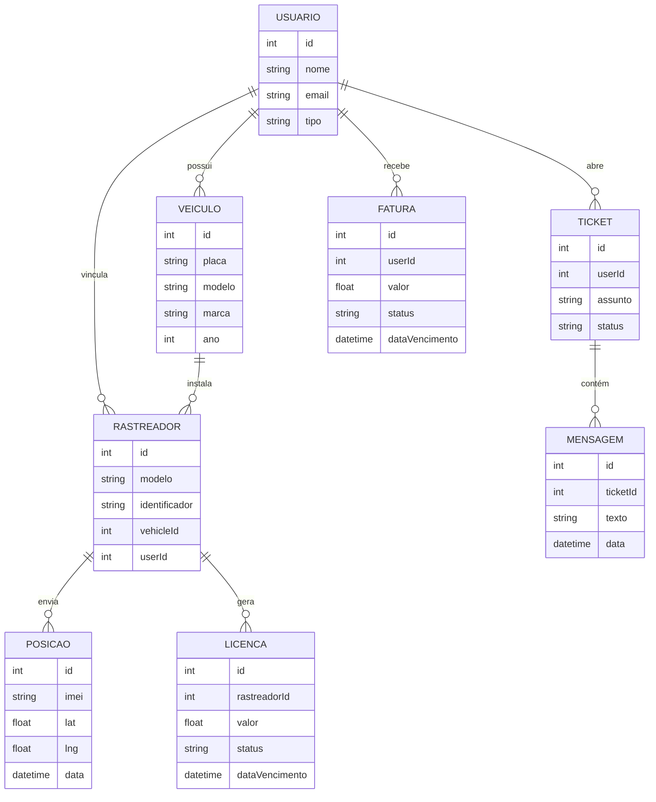

## Diagrama de Fluxo do Banco de Dados



# Sistema de Rastreamento Veicular

Este projeto é um sistema completo de rastreamento e gestão de veículos, desenvolvido com Next.js, Prisma e PostgreSQL. Permite controle de usuários, tickets de suporte, faturas, veículos, notificações e autenticação segura.

## Principais Funcionalidades

- Cadastro e autenticação de usuários (admin, funcionário, cliente)
- Gestão de veículos e rastreamento
- Tickets de suporte e mensagens
- Emissão e controle de faturas
- Painel administrativo
- Notificações por e-mail
- Proteção JWT nas rotas
- Interface moderna com Tailwind CSS

## Tecnologias Utilizadas

Next.js (App Router)
Prisma ORM
PostgreSQL (Neon)
Tailwind CSS
JWT para autenticação
bcryptjs para hash de senhas
Twilio para envio de SMS

## Como rodar o projeto

1. Instale as dependências:
   ```bash
   npm install
   ```
2. Configure o banco de dados em `.env` e `.env.local`:

   ```env
   DATABASE_URL=
   JWT_SECRET=

   ```

3. Execute as migrações do Prisma:
   ```bash
   npx prisma migrate dev --name init
   npx prisma generate
   ```
4. (Opcional) Crie um usuário admin:
   ```bash
   node scripts/create-admin.js
   ```
5. Inicie o servidor de desenvolvimento:
   ```bash
   npm run dev
   ```
6. Acesse [http://localhost:3000](http://localhost:3000) para usar o sistema.

**Atenção:**
Se for enviar comandos SMS para ativação do rastreador durante testes na rede local, utilize o IP de rede do seu computador, por exemplo:

- Local: http://localhost:3000
- Network: http://192.168.3.159:3000

O IP de rede (Network) deve ser informado no campo de IP do servidor na ativação do chip M2, para que o rastreador consiga se comunicar corretamente com seu backend durante os testes.

## Integração Twilio para envio de SMS

O sistema está preparado para envio de comandos SMS via Twilio. Para ativar:

1. Crie uma conta em [Twilio](https://www.twilio.com/).
2. Obtenha seu Account SID, Auth Token e número de envio.
3. Adicione as variáveis no arquivo `.env.local`:
   ```env
   TWILIO_ACCOUNT_SID=seu_account_sid
   TWILIO_AUTH_TOKEN=seu_auth_token
   TWILIO_PHONE_NUMBER=seu_numero_twilio
   ```
4. O endpoint `/api/send-sms` usará essas credenciais para enviar SMS para o número do chip M2.
5. O frontend exibe o status do envio via toast.

**Observação:** Para produção, utilize um número Twilio válido e configure limites de envio conforme sua conta.

## Estrutura de Pastas

- `app/` - Páginas, componentes e rotas da aplicação
- `prisma/` - Schema do banco de dados
- `scripts/` - Scripts utilitários (ex: criar admin)
- `public/` - Arquivos estáticos
- `utils/` - Utilitários e helpers

## Novos Fluxos Implementados

### Cadastro de Veículo

- Interface em `app/configuracoes/veiculo/page.tsx`.
- Permite cadastrar placa, modelo, marca, ano e selecionar usuário responsável de forma dinâmica.

### Cadastro e Ativação de Rastreador

- Interface em `app/configuracoes/rastreador/page.tsx`.
- Permite cadastrar modelo, identificador (IMEI), associar veículo e usuário (ambos dinâmicos), valor da licença e data de vencimento.
- Após cadastro, o sistema exibe um modal de ativação aguardando a primeira posição do rastreador.
- Quando a posição é recebida, o sistema mostra automaticamente a localização no Google Maps.
- O fluxo utiliza integração com a API `/api/rastreador/posicao?imei=...` para buscar a última posição do rastreador.

### Integração Completa Backend + Frontend

1. **Backend TCP Receptor:**

   - Rode o servidor TCP incluso:
     ```bash
     node scripts/tcp-server.js
     ```
   - Por padrão, escuta na porta 9000. O IP será o público do seu servidor (ou domínio).
   - O backend recebe pacotes do rastreador no formato: `IMEI,latitude,longitude` (ex: `123456789012345,-23.5505,-46.6333`).
   - Cada posição recebida é salva automaticamente no banco de dados via Prisma.

2. **API REST para o Frontend:**

   - O frontend busca a última posição do rastreador via API:
     ```
     GET /api/rastreador/posicao?imei=123456789012345
     ```
   - A resposta traz latitude/longitude para exibir no mapa.

3. **Fluxo Visual:**
   - Após cadastrar e ativar o rastreador, o sistema mostra o modal aguardando a posição.
   - Quando o backend recebe e salva a posição, o frontend exibe automaticamente no Google Maps.

#### Comandos de Ativação do Rastreador

Para ativar e configurar o rastreador (chip M2), envie os comandos abaixo via SMS ou API:

- Configurar APN:
  `APN,zap.vivo.com.br,vivo,vivo#`
- Configurar IP/porta do servidor:
  `SERVER,0,IP_DO_SEU_SERVIDOR,9000,0#`

## Navegação Mobile e Mapa Responsivo

Foi adicionada uma navegação inferior exclusiva para dispositivos móveis (`MobileBottomNav`) com as rotas principais do cliente:

- Dashboard
- Meus Veículos
- Financeiro
- Suporte (Tickets)

Características:

- O componente aparece somente para usuários autenticados quando a largura é `<768px`.
- O `Sidebar` tradicional é ocultado em telas pequenas para liberar espaço.
- O conteúdo principal recebe `padding-bottom` para não ficar sob a barra.
- Cada item exibe um indicador visual (barra azul) quando ativo.

### Mapa Full-Screen Mobile

Nas páginas `Meus Veículos` e `Usuarios/Rastreamento`, ao selecionar um rastreador em dispositivos móveis, o mapa abre em modo tela cheia com:

- Header compacto com botão "Voltar".
- Informações do rastreador (modelo e IMEI).
- Botões de ação (placeholders: Centralizar e Histórico) posicionados sobre o mapa, prontos para futuras funcionalidades.

Essa abordagem melhora a usabilidade em telas pequenas mantendo a mesma base de componentes do desktop.

### Dashboard: Mapa Fullscreen + Card Arrastável (Mobile)

No `Dashboard` (quando o usuário é cliente), o mapa agora possui um modo fullscreen focado apenas na área do mapa:

- Botão de expandir (ícone de cantos) aparece no canto superior direito apenas em telas <768px.
- Ao entrar em fullscreen, o `body` recebe `data-fullscreen="map"` permitindo ocultar elementos externos via CSS (ex: bottom nav) se desejado.
- O card de informações do veículo fica sobreposto na parte inferior e pode ser arrastado verticalmente (drag touch/mouse) quando em fullscreen.
- Snap automático em três alturas (baixa, média, alta) para melhorar a usabilidade.
- Fora do fullscreen, o card permanece fixo em posição confortável acima da navegação inferior.
- O mapa continua atualizando a posição e status do rastreador periodicamente.

Benefícios:

- Melhor aproveitamento de espaço em dispositivos pequenos.
- Interação semelhante a painéis modernos de apps de mobilidade (ex: pane deslizável sobre mapa).
- Código preparado para futuras ações (histórico, comandos adicionais, centralizar mapa).

Próximas melhorias sugeridas (não implementadas ainda):

- Animação de suavização ao arrastar (spring physics).
- Botão de centralizar última posição dentro do overlay superior.
- Exibição de múltiplos veículos com seleção dentro do card expansível.

Estrutura principal envolvida: `app/dashboard/page.tsx`.

### TopHeader Mobile

O cabeçalho agora possui duas versões:

- Desktop: mostra data extensa (ex: 13 de setembro 2025), avatar com iniciais, email e botão de logout.
- Mobile: barra fixa de 56px (h-14) com logo + nome do sistema (MoviTrace) à esquerda, data curta `dd/MM/yy` centralizada e nome do usuário com botão "Sair" vermelho à direita.

Um spacer (`<div class="h-14" />`) é inserido logo após o header mobile para evitar sobreposição do conteúdo.

- Configurar timezone:
  `GMT,W,0#`
- Configurar intervalo de comunicação:
  `TIMER,120,1800#`

**Importante:**

- O IP deve ser o público do seu servidor (ou domínio).
- A porta deve ser a mesma do backend TCP receptor (ex: 9000).

Após ativação, o rastreador enviará sua posição para o backend, que será exibida no sistema.

### Automação de Bloqueio

- Rastreadores com licença vencida e não paga são bloqueados automaticamente pelo backend.

### Integração Dinâmica

- Campos de seleção de usuário e veículo são preenchidos automaticamente com dados do banco, evitando erros de digitação e facilitando o fluxo.

## Como usar os cadastros e ativação

1. Acesse o painel de configurações.
2. Cadastre veículos e usuários normalmente.
3. Cadastre rastreadores associando ao veículo e usuário desejado.
4. O sistema gerará a licença/fatura automaticamente.
5. Após cadastrar o rastreador, envie os comandos de ativação para o chip M2.
6. O sistema exibirá o modal aguardando a primeira posição do rastreador.
7. Quando a posição for recebida, será mostrada automaticamente no Google Maps.
8. Se a licença não for paga até o vencimento, o rastreador será bloqueado.

## Observações

- Todas as operações de dados são feitas via Prisma Client.
- O sistema não utiliza mais Postgres Neon.
- As rotas protegidas exigem autenticação JWT.

## Documentação

- [Next.js](https://nextjs.org/docs)
- [Prisma](https://www.prisma.io/docs)
- [Neon](https://neon.tech/)

## Deploy

Para deploy, recomenda-se o uso do [Vercel](https://vercel.com/) ou outro serviço compatível com Next.js e PostgreSQL.

---

---

Sistema desenvolvido para rastreamento, gestão e suporte de veículos.
